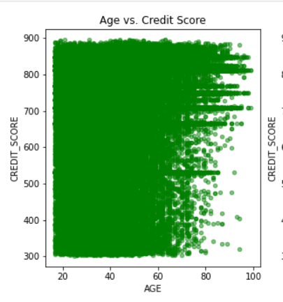

# Sneaky Score - Machine Learning Experience 
### Click the below link to see the "Sneaky Score" web view
This is Sneaky Score Site : [Sneaky Score](https://sonmiannkim-sneakyscore-app-0dnw3w.streamlitapp.com/)  
This is Google Slide link on preject outline : [Google Slide project outline](https://docs.google.com/presentation/d/1_ZDp58ladiEjxcG45n7MzcwYHcuHrU8W/edit?usp=sharing&ouid=102621752871254853292&rtpof=true&sd=true)  
This is Google Slide link on Web and final analysis : [Google Slide web](https://docs.google.com/presentation/d/1n58AX6Mx9fPvycsvNHpmHYC3LgHEiioN/edit?usp=sharing&ouid=102621752871254853292&rtpof=true&sd=true)

## Technology Used : 
- matplotlib==3.5.1
- numpy==1.21.6
- pandas==1.3.5
- plotly==5.6.0
- scikit_learn==1.1.2
- seaborn==0.11.2
- streamlit==1.11.1

## Overview of the Machine Motivation:
##### Have you ever wondered what totally unrelated data might do when you run your machine learning program?  Well, that was what I wanted to try.
I wanted to see what car you are driving might indicate what kind of financial freedom you have. Especially by Gender, Age.  It would be interesting to see since guys 
love what they are driving more than women.  so here we go.  I am about to predict your credit score!

##### Data
-	Drivers - This data is from a Car insurance company randomly selected from the year 2020 to 2022 insured or attempted to insure with no credit score or credit score
	- Features: Gender, DOB, Credit Score, Owned Vehicle ID (which maps to Vehicles data)
-	Vehicles - From HLDI vehicle service (Third party provides vehicle details A to Z) - selected vehicles between 2010 through 2022 only the following
	- Features: Year, Make, Model
	
- 	DataBase From : DB2
	
-	I am hoping that the data are somewhat related to each other and each feature tells me something meaningful about the owner’s credit score.

### Preprocessing the Data  

##### Processing tables
	 

##### Dummified Features
	 

-	Sample data of xlsx files generated from DB2 instances (500 rows) at the beginning of the project
- 	Created ETL programs such as with Samples:
	- DOB is converted to age	
	- Null, NA, and blank data is dropped
	- Gender is dummified, rather assigned to 0 (Female) or 1 (Male)
	- Question was what to do with the vehicle:  Dummified to Year, Make, Model (only the first part of the model name)
	- Ran a simple model, and gained some scores.
-	Real data of CSV files generated from DB2 instances (28 million rows).
	- Filtered Model counts more than 1000, though less than 1000 might not be significant.
	- Reduced to 7,468,462, drivers which were a lot easier to do than the rest ETLs
	- Total of 3547 vehicles remained to those drivers
	- Converted the categorical values to Predictable values using a dummy  function (Independent data)
	- As looking at the diagrams, there were many defaulted credit scores (The quotes didn't go further enough to order credit) and I dropped that as well.
	- Total of 1,048,547 data left (Less than 10 % of sales, that'd been expected)
	- Ran K-Means to determine the Bin size and it was similar to standard credit score evaluation, so decided to go for it, since it can be very well used when interacting with a web application.
	- Later made it to the range rather reflect the true standard values of the following: 850 -Superior, 795-Excellent, 690-Good, 625-Average, 570-Below Average, 525-Poor 
	- When predicted, added an explanation to the score. (see web presentation on "After Math - Omitted Variable Bias" section)

### Clustering Drivers/Vehicles Using K-means - 
KMeans – using centroid relocate each centroid to the mean of its assigned observations until the clusters no longer change
	
Note 1: Also we can use the WWS (within-cluster sum of Squares)

Note 2: Although I ended up using the standard evaluation of the credit score, K-means showed very similar to the range.

### visualizing to Understand the data
Simple Graphs were generated to visualize the data
##### Age with outliers

##### Population Diagram

##### Correlation Heatmap

##### 3D View with bucketed score

##### Scatter View with the bucketed score

### Modeling
- Scaling - Standard Scaling is used from sklearn processing to normalize the data
- Basic Linear Regression to see expected scores (Score is the R2 Score, which varies between 0 to 100%): 0.025 ( As expected, it wasn't feasible, where it made me almost switch or add more data, but for sake of the project, continued)
- For project purposes, the Multiple Linear Regression Model, Decision Tree Regression Model, and Random Forest Regression Model were tested
- Actual Scores and expected scores were compared

- Attempt to improve the score : Using GridSeachCV to see if we can optimize using different parameters using different parameter setup.  However, it remained the same mean squared error of about 1.2

## Analysis Results:
- The result wasn't what I expected.  There will be several reasons for the result as I inspect the history chart. Almost 70 to 80 % population belongs to the credit range of upper 600 to mid-800s which means majorities belong to the Good thru Excellent range.
- Ages are also noticed. The population average is mid-40th, although there are many between 20 to 40s, still, it is unbalanced.
- Another issue that wasn't considered was this data is from secondary insurance services, therefore majorities have an accident or two.  Considering the fact, that they would want to purchase the car insurance that gives them the lowest premium, therefore good credit standing is required.
- Also Vehicle population is very concentrated in the middle-class range, not a huge difference in price
- Overall, the project seems to swim around the pool rather than the ocean. (Note: More details can be found in Web presentation : After Math & Omitted Variable Bias)

## Analysis Summary:
Mission accomplished. Always the process is better than the result.  Many steps required research and I've done the plenty last 4 weeks. 
Therefore, I am satisfied with what I've got. Finally, all things go back to normal and I will continue the Machine Learning threads, perhaps one day I look back and say "Did I do that? Oh..." Leave it to the future now.

