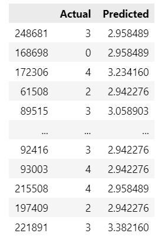

# Sneak Score - Machine Learning Experience 
### Click below link to see "Sneaky Score" web view

## Overview of the Machine Motivation:
##### Have you ever wondered what totally unrelated data might do when you run your machine learning program?  Well, that was what I wanted to try.
I wanted to see what car you are driving might indicate what kind financial freedom you have. Especially by Gender, Age.  It would be interesting to see since guys 
love what they are driving more than women.  so here we go.  I am about to predict the your credit score!

##### Data
-	Drivers - This data is from a Car insurance company randomly selected from year 2020 to 2022 insured or attempted to insure with no credit score or credit score
	- Features: Gender, DOB, Credit Score, Owned Vehicle ID (which maps to Vehicles data)
-	Vehicles - From HLDI vehicle service (Third party provides vehicle details A to Z) - selected vhicles between 2010 through 2022 only the followings
	- Features: Year, Make, Model
	
- 	DataBase From : DB2
	
-	I am hoping that the data is somewhat releated each other and each features tells me something meaningful about the owner credit score.

### Preprocessing the Data  

	 
		
	 

-	Sample data of xlsx files generated from DB2 instances (500 rows) in the begining of the project
- 	Created ETL programs such as with Samples :
	- DOB is converted to age	
	- Null, NA, blank data is dropped
	- Gender is dummified, rather assigned to 0 (Female) or 1 (Male)
	- Question was what to do with vehicle :  Dummified to Year, Make, Model (only the first part of model name)
	- Ran a simple model, and gained some score.
-	Real data of csv files generated from DB2 instances (28 million rows).
	- Filtered Model counts more than 1000, thought less than 1000 might not be significant.
	- Reduced to 7,468,462, drivers which was a lot easier to do the rest ETLs
	- Total of 3547 vehicles remained to those drivers
	- Converted the categorical values to Predictable values using dummy  function (Independent data)
	- As looking at the diagrams, there were many defaulted credit scores ( The quotes didn't go further enough to order credit) and I dropped that as well.
	- Total of 1,048,547 data left (Less than 10 % sales, that'd been expected)
	- Ran K-Means to determine the Bin size and it was similar to standard credit score evaluation, so decided go for it, since it can be very well used when it is interacting web application.
	- Later made it to the range rather to reflect the true standard values of following: 850~Superior, 795~Excellent, 690~Good, 625~Average, 570~Below Average, 525~Poor 
	- When predicted, added an explaination to the score.
	
### Clustering Drivers/Vehicles Using K-means - 
KMeans – using centroid relocate each centroid to the mean of its assigned ovservations until the clusters no longer change
	
Note 1: Also we can use  the WWS (within-cluster sum of Squares)

Note 2: Although I ended up using the standard evaluation of the credit score, K-means showed very smilar to the range.

### visualizing to Understand the data
Simple Graphs were generated to visualize the data
##### Age with outliers

##### Population Diagram

##### Correlation Heatmap

##### 3D View with bucketed score

### Modeling
- Scaling - Standard Scaling is used from sklearn processing to nomalize the data
- Basic Linear Regression to see exepected scores (Score is the R2 Score, which varies between 0 to 100%) : 0.025 ( As expected, it wasn't feasible, where it made me to almost switch or add more data, but for sake of the project, continued)
- For project purposes Multiple Linear Regression Model, Decision Tree Regression Model, Random Forest Regression Model was tested
- To compare / cross Evaluation K-Fold cross Validation, R2 Score, MSE (Mean Squared Error), RSME (Root Mean Squared Error)  was generated

- Also Actual Score and expected scores were compared

## Analysis Results:
- The result wasn't what I expected.  There will be several reason for the result as I inspect the history chart. Almost 70 to 80 % population belongs to the credit range of upper 600 to mid 800 which means majorities are belong to Good thru Excellent range.
- Ages are also noticed. Poplution average is mid 40th, although there are many between 20 to 40s, still it is unbalanced.
- Another issue wasn't considered was this data is from secondary insurance service, therefore majorities have an accident or two.  Considering the fact, they would want to purchase the car insurance that gives them lowest premium, therefore good credit standing is required.
- Also Vehicle population is very concentrated on middle class range, not a huge differences in price
- Overall, the project seem swam around the pool rather than the ocean. 

## Analysis Summary:
Mission accomplished. Alwasy the process is better than the result.  Many steps required research and I've done the plenty last 4 weeks. 
Therefore I am satisfied what I've got. Finally all things go back to normal and I will continue the  Machine Learning threads, perhaps one day I look back and say "Did I do that? Oh..." Leave it to the future now.

